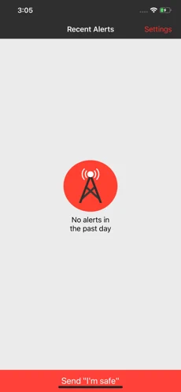
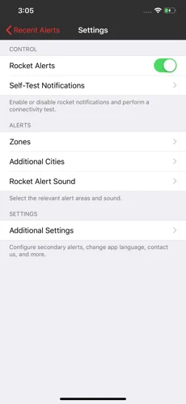

<h1>  RedAlert for iOS</h1>

RedAlert was developed by volunteers to provide real-time rocket alerts for Israeli citizens.

* [Official Site](https://redalert.me)
* [App Store Listing](https://apps.apple.com/il/app/zb-dwm-htr-wt-bzmn-mt/id937914925)
* [Google Play Listing](https://play.google.com/store/apps/details?id=com.red.alert)

The app utilizes real-time alert data provided by the Home Front Command (Pikud Haoref), which makes it extremely fast, reliable, and stable.

> Note: Rocket alerts are detected using the open-source [pikud-haoref-api](https://github.com/eladnava/pikud-haoref-api) Node.js package.

## Screenshots

 

## Achievements

* Published by **Geektime** as [the fastest rocket alert app](http://www.geektime.co.il/push-notifications-at-protective-edge/)
* Featured by the Israeli government on their [Google+ page](https://plus.google.com/+Israel/posts/U3juWS1YPK4)
* Ranked **1st place** on **Google Play's Top Free** in Israel for 4 weeks during Operation Protective Edge
* Won **2nd place** in the [Ford SYNC AppLink TLV](https://eladnava.com/how-we-won-2nd-place-ford-tel-aviv-hackathon/) hackathon for integrating the app with Ford cars

## Features

#### The fastest, most reliable rocket alert application.

* Search - select preferred alert cities / regions by searching for them
* Speed - rocket alerts are received before / during the official siren
* Connectivity - check, at any time, whether your device is able to receive rocket alerts via the "self-test" option
* Broadcast - let your friends and family know you are safe by sending an "I'm safe" message via the app
* Sounds - choose from 15 unique sounds for rocket alerts
* Vibration - your phone will vibrate in addition to playing the selected alert sound
* History - display the list of daily rocket alerts, their location, and time of day (in your local time)
* Scalability - the app is deployed to a cloud service which scales automatically to provide alerts to all users

## Requirements for Development
* Xcode 10.1+
* A physical iOS device to test on (the iOS simulator cannot receive push notifications)

## Collaborating

* If you find a bug or wish to make some kind of change, please create an issue first
* Make your commits as tiny as possible - one feature or bugfix at a time
* Write detailed commit messages, in-line with the project's commit naming conventions
* Make sure your code conventions are in-line with the project

## Donations

The application was developed to protect Israeli citizens. 
It costs money to run the servers, your donation is greatly appreciated.

* [Donate via Paypal](https://www.paypal.com/cgi-bin/webscr?cmd=_donations&business=eladnava@gmail.com&lc=US&item_name=RedAlert&no_note=0&cn=&curency_code=USD&bn=PP-DonationsBF:btn_donateCC_LG.gif:NonHosted)

## Special Thanks

* Thanks to Ilana Badner for the Russian translation
* Thanks to Rodolphe Moulin for the French translation
* Thanks to Matteo Villosio for the Italian translation
* Thanks to Nathan Allenberg for the Spanish translation
* Thanks to David Halbani for the German translation
* Thanks to Eden Glant for the "Siren 1" and "Siren 2" sounds

## License

Apache 2.0